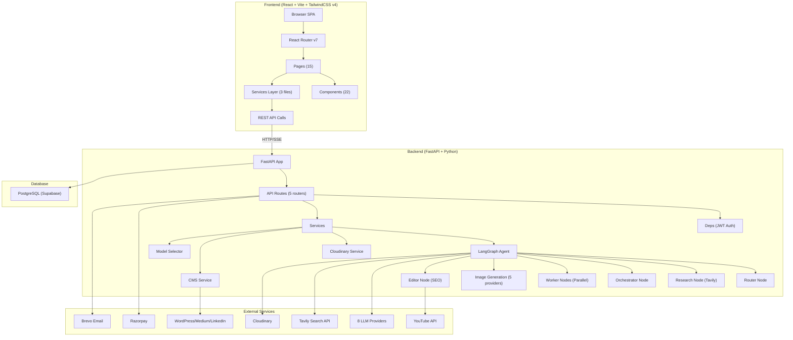

# 🔍 Comprehensive Repository Audit Report — BlogFusion AI

**Project:** Blog Writing AI Agent (BlogFusion)
**Audit Date:** 2026-07-20
**Auditor:** Staff Engineer / Security Engineer AI Audit
**Repository Root:** `c:\Users\saura\OneDrive\Documents\Desktop\GenAi Projects\Blog Writing AI Agent`

---

## 1. Executive Summary

**BlogFusion AI** is a full-stack SaaS application that uses a LangGraph multi-agent AI workflow to generate SEO-optimized technical blog posts. Users provide a topic and configuration, and the system autonomously researches, outlines, writes, generates images, and optimizes content. The platform features a React/TypeScript frontend and Python FastAPI backend, with PostgreSQL as the database, and integrates with 8+ AI providers, Cloudinary for image hosting, Razorpay for payments, and CMS platforms (WordPress, Medium, LinkedIn) for publishing.

### Key Findings at a Glance

| Category | Score | Grade |
|---|---|---|
| **Code Quality** | 68/100 | C+ |
| **Maintainability** | 72/100 | B- |
| **Security** | 25/100 | 🔴 F |
| **Scalability** | 55/100 | D+ |
| **Production Readiness** | 20/100 | 🔴 F |

> [!CAUTION]
> **The `.env` file containing live production API keys and database credentials is committed to the repository.** This is the single most critical finding. Every API key (OpenAI, Anthropic, Google, Razorpay, Cloudinary, Brevo, database password, JWT secret, encryption key) is exposed in plaintext at [backend/.env](file:///c:/Users/saura/OneDrive/Documents/Desktop/GenAi%20Projects/Blog%20Writing%20AI%20Agent/backend/.env). **Immediate rotation of all secrets is required.**

---

## 2. Architecture Overview



### Architecture Pattern
- **Frontend:** Single Page Application (SPA) with client-side routing
- **Backend:** Monolithic FastAPI server with synchronous SQLModel ORM
- **AI Engine:** LangGraph StateGraph with 8 nodes using a fan-out/fan-in pattern for concurrent section writing
- **Communication:** REST API + Server-Sent Events (SSE) for real-time streaming

---

## 3. Technology Stack

| Layer | Technology | Version |
|---|---|---|
| **Frontend Framework** | React | 19.2.7 |
| **Build Tool** | Vite | 8.1.1 |
| **CSS Framework** | TailwindCSS | 4.3.2 |
| **Language** | TypeScript | ~6.0.2 |
| **Routing** | React Router DOM | 7.18.1 |
| **State Management** | React Context | (built-in) |
| **Charts** | Recharts | 3.9.2 |
| **Markdown** | react-markdown | 10.1.0 |
| **Backend Framework** | FastAPI | latest |
| **ORM** | SQLModel | latest |
| **Database** | PostgreSQL | (Supabase hosted) |
| **AI Orchestration** | LangGraph | latest |
| **LLM Providers** | OpenAI, Anthropic, Gemini, DeepSeek, Groq, Cohere, OpenRouter | various |
| **Image CDN** | Cloudinary | latest |
| **Payments** | Razorpay | latest |
| **Email** | Brevo (Sendinblue) | REST API v3 |
| **Deployment (FE)** | Vercel | vercel.json present |
| **Deployment (BE)** | Gunicorn | (in requirements.txt) |

---

## 4. Folder Structure Review

### Current Structure
```
Blog Writing AI Agent/
├── backend/
│   ├── .env                    ⚠️ CONTAINS LIVE SECRETS - COMMITTED
│   ├── .env.example            ✅ Template file
│   ├── .gitignore              ✅ Present
│   ├── requirements.txt        ⚠️ No version pinning
│   ├── alembic.ini             ✅ Migration config
│   ├── alembic/
│   │   ├── env.py              ✅ Alembic environment
│   │   └── versions/           ✅ 6 migration files
│   ├── app/
│   │   ├── __init__.py
│   │   ├── main.py             ✅ FastAPI entry point
│   │   ├── api/
│   │   │   ├── deps.py         ✅ Auth dependencies
│   │   │   └── routes/
│   │   │       ├── auth.py     ✅ Auth endpoints
│   │   │       ├── blogs.py    ✅ Blog CRUD + generation
│   │   │       ├── payments.py ✅ Razorpay integration
│   │   │       ├── support.py  ✅ Contact/Feedback
│   │   │       └── users.py    ✅ User profile + dashboard
│   │   ├── core/
│   │   │   ├── config.py       ✅ Pydantic settings
│   │   │   ├── db.py           ✅ Database engine
│   │   │   ├── email.py        ✅ Brevo email service
│   │   │   ├── limiter.py      ✅ Rate limiting
│   │   │   ├── llm_models.py   ⚠️ Partially stale model names
│   │   │   ├── model_registry.py ✅ Canonical model registry
│   │   │   └── security.py     ✅ JWT + bcrypt + Fernet
│   │   ├── models/
│   │   │   ├── blog.py         ✅ Blog SQLModel
│   │   │   ├── payment.py      ✅ Payment SQLModel
│   │   │   ├── support.py      ✅ Contact/Feedback SQLModel
│   │   │   └── user.py         ✅ User SQLModel
│   │   └── services/
│   │       ├── cloudinary_service.py  ✅ Image upload
│   │       ├── cms_service.py         ✅ WP/Medium/LinkedIn
│   │       ├── model_selector.py      ✅ Provider factory
│   │       └── agent/
│   │           ├── __init__.py
│   │           ├── agent.py           ✅ Graph definition
│   │           ├── image_service.py   ✅ Multi-provider images
│   │           ├── nodes.py           ✅ All graph node logic
│   │           ├── prompt.py          ✅ System prompts
│   │           └── state.py           ✅ Pydantic schemas + state
│   └── venv/                    🗑 Should not be committed
│   └── __pycache__/             🗑 Should not be committed
│
├── frontend/
│   ├── .env                    ⚠️ Contains API keys - COMMITTED
│   ├── .env.example            ✅ Template
│   ├── package.json            ✅ Dependencies
│   ├── vercel.json             ✅ SPA rewrite rules
│   ├── vite.config.ts          ✅ Vite configuration
│   ├── index.html              ✅ Entry HTML
│   ├── dist/                   🗑 Build output - should not be committed
│   ├── src/
│   │   ├── App.tsx             ✅ Root component + routing
│   │   ├── App.css             🗑 Empty file
│   │   ├── main.tsx            ✅ React entry
│   │   ├── index.css           ✅ TailwindCSS imports
│   │   ├── config/models.ts    ✅ Frontend model list
│   │   ├── context/AuthContext.tsx ✅ Auth state provider
│   │   ├── layouts/            ✅ Route guards
│   │   ├── pages/              ✅ 15 page components
│   │   ├── components/         ✅ 14 + 8 workspace-tab components
│   │   ├── services/           ✅ 3 API service files
│   │   └── utils/              ✅ 3 utility files
│   └── node_modules/           🗑 Should not be committed
└── .git/
```

### Issues Found

| Issue | Severity | Location |
|---|---|---|
| `venv/` directory committed | Medium | `backend/venv/` |
| `__pycache__/` directories committed | Low | Multiple backend dirs |
| `dist/` build output committed | Medium | `frontend/dist/` |
| `node_modules/` committed | Medium | `frontend/node_modules/` |
| `App.css` is completely empty | Low | `frontend/src/App.css` |
| No `README.md` at project root | Medium | Root directory |
| No `README.md` in backend | Medium | `backend/` |
| No `Dockerfile` or `docker-compose.yml` | High | Root directory |

### Recommended Ideal Structure
The current structure is reasonably organized following a standard FastAPI backend / React frontend monorepo pattern. Key improvements needed:
- Add a root `README.md`
- Add `Dockerfile` and `docker-compose.yml`
- Remove committed `venv/`, `node_modules/`, `dist/`, and `__pycache__/` directories
- Delete the empty `App.css`
- Add a `backend/tests/` directory

---

## 5. Implemented Features

### Feature 1: User Authentication & Registration
- **Purpose:** Email/password signup with OTP verification, login, Google OAuth, password reset
- **Files:** [auth.py](file:///c:/Users/saura/OneDrive/Documents/Desktop/GenAi%20Projects/Blog%20Writing%20AI%20Agent/backend/app/api/routes/auth.py), [security.py](file:///c:/Users/saura/OneDrive/Documents/Desktop/GenAi%20Projects/Blog%20Writing%20AI%20Agent/backend/app/core/security.py), [email.py](file:///c:/Users/saura/OneDrive/Documents/Desktop/GenAi%20Projects/Blog%20Writing%20AI%20Agent/backend/app/core/email.py), [AuthContext.tsx](file:///c:/Users/saura/OneDrive/Documents/Desktop/GenAi%20Projects/Blog%20Writing%20AI%20Agent/frontend/src/context/AuthContext.tsx), [Login.tsx](file:///c:/Users/saura/OneDrive/Documents/Desktop/GenAi%20Projects/Blog%20Writing%20AI%20Agent/frontend/src/pages/Login.tsx), [Signup.tsx](file:///c:/Users/saura/OneDrive/Documents/Desktop/GenAi%20Projects/Blog%20Writing%20AI%20Agent/frontend/src/pages/Signup.tsx)
- **Flow:** Signup → OTP email → Verify OTP → JWT issued → stored in localStorage
- **Status:** ✅ Complete
- **Issues:** OTP stored in plaintext in DB; JWT stored in localStorage (XSS vulnerable)

### Feature 2: AI Blog Generation (LangGraph Multi-Agent Pipeline)
- **Purpose:** Autonomous end-to-end blog creation with research, planning, writing, images, SEO
- **Files:** [agent.py](file:///c:/Users/saura/OneDrive/Documents/Desktop/GenAi%20Projects/Blog%20Writing%20AI%20Agent/backend/app/services/agent/agent.py), [nodes.py](file:///c:/Users/saura/OneDrive/Documents/Desktop/GenAi%20Projects/Blog%20Writing%20AI%20Agent/backend/app/services/agent/nodes.py), [state.py](file:///c:/Users/saura/OneDrive/Documents/Desktop/GenAi%20Projects/Blog%20Writing%20AI%20Agent/backend/app/services/agent/state.py), [prompt.py](file:///c:/Users/saura/OneDrive/Documents/Desktop/GenAi%20Projects/Blog%20Writing%20AI%20Agent/backend/app/services/agent/prompt.py), [blogs.py routes](file:///c:/Users/saura/OneDrive/Documents/Desktop/GenAi%20Projects/Blog%20Writing%20AI%20Agent/backend/app/api/routes/blogs.py)
- **Flow:** Router → (optional) Research → Orchestrator → Fan-out Workers → Image Planning → Image Generation → Content Merge → Editor (SEO + YouTube)
- **Status:** ✅ Complete
- **Issues:** No timeout for individual agent node execution; long-running SSE can exhaust server resources

### Feature 3: Real-time SSE Streaming
- **Purpose:** Live progress updates during blog generation
- **Files:** [blogs.py L117-348](file:///c:/Users/saura/OneDrive/Documents/Desktop/GenAi%20Projects/Blog%20Writing%20AI%20Agent/backend/app/api/routes/blogs.py#L117-L348), [Workspace.tsx](file:///c:/Users/saura/OneDrive/Documents/Desktop/GenAi%20Projects/Blog%20Writing%20AI%20Agent/frontend/src/pages/Workspace.tsx)
- **Status:** ✅ Complete
- **Issues:** JWT token passed in URL query parameter (exposed in logs)

### Feature 4: Multi-Provider LLM Support
- **Purpose:** Support for OpenAI, Anthropic, Gemini, DeepSeek, Groq, Cohere, OpenRouter
- **Files:** [model_registry.py](file:///c:/Users/saura/OneDrive/Documents/Desktop/GenAi%20Projects/Blog%20Writing%20AI%20Agent/backend/app/core/model_registry.py), [model_selector.py](file:///c:/Users/saura/OneDrive/Documents/Desktop/GenAi%20Projects/Blog%20Writing%20AI%20Agent/backend/app/services/model_selector.py), [llm_models.py](file:///c:/Users/saura/OneDrive/Documents/Desktop/GenAi%20Projects/Blog%20Writing%20AI%20Agent/backend/app/core/llm_models.py)
- **Status:** ✅ Complete
- **Issues:** `llm_models.py` contains stale mock model names that diverge from `model_registry.py`

### Feature 5: Multi-Provider Image Generation
- **Purpose:** Generate blog images via OpenAI, Gemini, Cloudflare, HuggingFace, Pollinations
- **Files:** [image_service.py](file:///c:/Users/saura/OneDrive/Documents/Desktop/GenAi%20Projects/Blog%20Writing%20AI%20Agent/backend/app/services/agent/image_service.py)
- **Status:** ✅ Complete

### Feature 6: Payment System (Razorpay)
- **Purpose:** Pro plan purchase (₹499), credit system, payment verification
- **Files:** [payments.py](file:///c:/Users/saura/OneDrive/Documents/Desktop/GenAi%20Projects/Blog%20Writing%20AI%20Agent/backend/app/api/routes/payments.py), [payment.py model](file:///c:/Users/saura/OneDrive/Documents/Desktop/GenAi%20Projects/Blog%20Writing%20AI%20Agent/backend/app/models/payment.py), [razorpay.ts](file:///c:/Users/saura/OneDrive/Documents/Desktop/GenAi%20Projects/Blog%20Writing%20AI%20Agent/frontend/src/utils/razorpay.ts)
- **Status:** ✅ Complete
- **Issues:** Hardcoded amount (49900 paise); no webhook verification endpoint

### Feature 7: CMS Publishing (WordPress, Medium, LinkedIn)
- **Purpose:** One-click publishing of generated blogs to external CMS platforms
- **Files:** [cms_service.py](file:///c:/Users/saura/OneDrive/Documents/Desktop/GenAi%20Projects/Blog%20Writing%20AI%20Agent/backend/app/services/cms_service.py), [blogs.py L537-621](file:///c:/Users/saura/OneDrive/Documents/Desktop/GenAi%20Projects/Blog%20Writing%20AI%20Agent/backend/app/api/routes/blogs.py#L537-L621)
- **Status:** ✅ Complete
- **Issues:** `markdown_it` imported but not in `requirements.txt` — will crash at runtime

### Feature 8: User Dashboard with Analytics
- **Purpose:** Displays blog stats, credits, token usage, 30-day activity charts
- **Files:** [users.py L50-156](file:///c:/Users/saura/OneDrive/Documents/Desktop/GenAi%20Projects/Blog%20Writing%20AI%20Agent/backend/app/api/routes/users.py#L50-L156), [Dashboard.tsx](file:///c:/Users/saura/OneDrive/Documents/Desktop/GenAi%20Projects/Blog%20Writing%20AI%20Agent/frontend/src/pages/Dashboard.tsx)
- **Status:** ✅ Complete

### Feature 9: Settings Page (Profile, Cloudinary, CMS, Brand Persona)
- **Purpose:** User profile management, API key storage, brand persona configuration
- **Files:** [Settings.tsx](file:///c:/Users/saura/OneDrive/Documents/Desktop/GenAi%20Projects/Blog%20Writing%20AI%20Agent/frontend/src/pages/Settings.tsx), [users.py routes](file:///c:/Users/saura/OneDrive/Documents/Desktop/GenAi%20Projects/Blog%20Writing%20AI%20Agent/backend/app/api/routes/users.py)
- **Status:** ✅ Complete
- **Issues:** CMS tokens stored without encryption in UserUpdate path (only `cms_wordpress_app_password` and `cms_medium_token` are encrypted via Fernet in the model)

### Feature 10: Blog Editor with AI Regeneration
- **Purpose:** Edit markdown in-browser, select text and regenerate via AI
- **Files:** [MainWorkspace.tsx](file:///c:/Users/saura/OneDrive/Documents/Desktop/GenAi%20Projects/Blog%20Writing%20AI%20Agent/frontend/src/components/MainWorkspace.tsx), [EditorTab.tsx](file:///c:/Users/saura/OneDrive/Documents/Desktop/GenAi%20Projects/Blog%20Writing%20AI%20Agent/frontend/src/components/workspace-tabs/EditorTab.tsx)
- **Status:** ✅ Complete (Pro-only feature)

### Feature 11: Blog Preview with Mermaid, KaTeX, Syntax Highlighting
- **Purpose:** Rich markdown preview with diagram rendering
- **Files:** [PreviewTab.tsx](file:///c:/Users/saura/OneDrive/Documents/Desktop/GenAi%20Projects/Blog%20Writing%20AI%20Agent/frontend/src/components/workspace-tabs/PreviewTab.tsx), [MermaidDiagram.tsx](file:///c:/Users/saura/OneDrive/Documents/Desktop/GenAi%20Projects/Blog%20Writing%20AI%20Agent/frontend/src/components/MermaidDiagram.tsx)
- **Status:** ✅ Complete
- **Issues:** XSS vulnerability — `rehype-raw` enabled without `rehype-sanitize`

### Feature 12: Contact & Feedback Forms
- **Purpose:** Public contact form and authenticated feedback submission
- **Files:** [Contact.tsx](file:///c:/Users/saura/OneDrive/Documents/Desktop/GenAi%20Projects/Blog%20Writing%20AI%20Agent/frontend/src/pages/Contact.tsx), [Feedback.tsx](file:///c:/Users/saura/OneDrive/Documents/Desktop/GenAi%20Projects/Blog%20Writing%20AI%20Agent/frontend/src/pages/Feedback.tsx), [support.py routes](file:///c:/Users/saura/OneDrive/Documents/Desktop/GenAi%20Projects/Blog%20Writing%20AI%20Agent/backend/app/api/routes/support.py)
- **Status:** ✅ Complete
- **Issues:** No rate limiting on support endpoints; no input sanitization

### Feature 13: PDF Export
- **Purpose:** Export generated blog as PDF
- **Files:** [MainWorkspace.tsx](file:///c:/Users/saura/OneDrive/Documents/Desktop/GenAi%20Projects/Blog%20Writing%20AI%20Agent/frontend/src/components/MainWorkspace.tsx) (uses `jspdf`)
- **Status:** ⚠️ Partially Complete (basic text export, no formatting)

### Feature 14: Blog History & Management
- **Purpose:** List, view, rename, delete past blogs
- **Files:** [HistoryTab.tsx](file:///c:/Users/saura/OneDrive/Documents/Desktop/GenAi%20Projects/Blog%20Writing%20AI%20Agent/frontend/src/components/workspace-tabs/HistoryTab.tsx), [Sidebar.tsx](file:///c:/Users/saura/OneDrive/Documents/Desktop/GenAi%20Projects/Blog%20Writing%20AI%20Agent/frontend/src/components/Sidebar.tsx), [blogs.py routes](file:///c:/Users/saura/OneDrive/Documents/Desktop/GenAi%20Projects/Blog%20Writing%20AI%20Agent/backend/app/api/routes/blogs.py)
- **Status:** ✅ Complete

### Feature 15: Account Deletion
- **Purpose:** User can delete their account and all associated data
- **Files:** [users.py L158-181](file:///c:/Users/saura/OneDrive/Documents/Desktop/GenAi%20Projects/Blog%20Writing%20AI%20Agent/backend/app/api/routes/users.py#L158-L181)
- **Status:** ✅ Complete
- **Issues:** No confirmation required at API level; a compromised token could wipe an account

---

## 6. Missing Features

| Feature | Priority | Notes |
|---|---|---|
| Email verification for CMS token changes | High | Sensitive credential changes have no re-authentication |
| Admin panel | Medium | No admin functionality for user management, content moderation |
| Blog sharing / public URLs | Medium | Blogs are private; no public view or share link feature |
| Password change (while logged in) | Medium | Only reset-via-email exists |
| Account deactivation vs. hard deletion | Low | Only permanent deletion available |
| Rate limit on blog generation per user | High | Only API-level rate limit, not user-level credit-based throttling |
| Webhook for payment confirmation | High | Razorpay webhooks not implemented for server-to-server verification |
| Tests | Critical | Zero test files exist in the entire repository |
| Logging framework | Medium | Uses `print()` statements throughout, no structured logging |

---

## 7. Dead Code Report

| Item | Type | File | Reason |
|---|---|---|---|
| `App.css` | File | [App.css](file:///c:/Users/saura/OneDrive/Documents/Desktop/GenAi%20Projects/Blog%20Writing%20AI%20Agent/frontend/src/App.css) | Completely empty, 0 bytes. Imported nowhere. **Safe to remove.** |
| `CEREBRAS_API_KEY` | Env Var | [.env L7](file:///c:/Users/saura/OneDrive/Documents/Desktop/GenAi%20Projects/Blog%20Writing%20AI%20Agent/backend/.env#L7) | Not referenced in any code. Not in `config.py`. **Safe to remove.** |
| `BlogFusion_pass` | Env Var | [.env L17](file:///c:/Users/saura/OneDrive/Documents/Desktop/GenAi%20Projects/Blog%20Writing%20AI%20Agent/backend/.env#L17) | Not referenced in any code. **Safe to remove.** |
| `EditorOutput` | Class | [state.py L181-186](file:///c:/Users/saura/OneDrive/Documents/Desktop/GenAi%20Projects/Blog%20Writing%20AI%20Agent/backend/app/services/agent/state.py#L181-L186) | Defined but never imported or used anywhere. The `editor_node` uses `SEOMetadata` directly. **Safe to remove.** |
| `FAMILY_*` constants | Constants | [llm_models.py L20-27](file:///c:/Users/saura/OneDrive/Documents/Desktop/GenAi%20Projects/Blog%20Writing%20AI%20Agent/backend/app/core/llm_models.py#L20-L27) | `FAMILY_GROQ` and `FAMILY_OPENROUTER` are defined but never used. The `model_registry.py` supersedes them. |
| `REAL_MODEL_MAP` | Dict | [llm_models.py L29-47](file:///c:/Users/saura/OneDrive/Documents/Desktop/GenAi%20Projects/Blog%20Writing%20AI%20Agent/backend/app/core/llm_models.py#L29-L47) | Only used for image model lookup in `image_service.py`. The text model mappings are superseded by `model_registry.py`. Partially dead. |
| `MODEL_GPT_EXPENSIVE` | Constant | [llm_models.py L6](file:///c:/Users/saura/OneDrive/Documents/Desktop/GenAi%20Projects/Blog%20Writing%20AI%20Agent/backend/app/core/llm_models.py#L6) | Not imported or used anywhere. **Safe to remove.** |
| `MODEL_GPT_BALANCED` | Constant | [llm_models.py L7](file:///c:/Users/saura/OneDrive/Documents/Desktop/GenAi%20Projects/Blog%20Writing%20AI%20Agent/backend/app/core/llm_models.py#L7) | Not imported or used anywhere. **Safe to remove.** |
| `MODEL_GPT_CHEAP` | Constant | [llm_models.py L8](file:///c:/Users/saura/OneDrive/Documents/Desktop/GenAi%20Projects/Blog%20Writing%20AI%20Agent/backend/app/core/llm_models.py#L8) | Not imported or used anywhere. **Safe to remove.** |
| `MODEL_CLAUDE_EXPENSIVE` | Constant | [llm_models.py L12](file:///c:/Users/saura/OneDrive/Documents/Desktop/GenAi%20Projects/Blog%20Writing%20AI%20Agent/backend/app/core/llm_models.py#L12) | Not imported or used anywhere. **Safe to remove.** |
| `MODEL_CLAUDE_CHEAP` | Constant | [llm_models.py L13](file:///c:/Users/saura/OneDrive/Documents/Desktop/GenAi%20Projects/Blog%20Writing%20AI%20Agent/backend/app/core/llm_models.py#L13) | Not imported or used anywhere. **Safe to remove.** |
| `MODEL_GEMINI_EXPENSIVE` | Constant | [llm_models.py L16](file:///c:/Users/saura/OneDrive/Documents/Desktop/GenAi%20Projects/Blog%20Writing%20AI%20Agent/backend/app/core/llm_models.py#L16) | Not imported or used anywhere. **Safe to remove.** |
| `MODEL_GEMINI_CHEAP` | Constant | [llm_models.py L17](file:///c:/Users/saura/OneDrive/Documents/Desktop/GenAi%20Projects/Blog%20Writing%20AI%20Agent/backend/app/core/llm_models.py#L17) | Not imported or used anywhere. **Safe to remove.** |
| `md_with_placeholders` | State key | [state.py L154](file:///c:/Users/saura/OneDrive/Documents/Desktop/GenAi%20Projects/Blog%20Writing%20AI%20Agent/backend/app/services/agent/state.py#L154) | Declared in `BlogState` but never written to or read by any node. **Safe to remove.** |
| `UserSettings` interface | Type | [users.ts L3-11](file:///c:/Users/saura/OneDrive/Documents/Desktop/GenAi%20Projects/Blog%20Writing%20AI%20Agent/frontend/src/services/users.ts#L3-L11) | Exported but never imported by any consumer. **Can be removed.** |
| `icon.png` | Asset | `frontend/public/icon.png` | Not referenced in `index.html` or any component. `icon2.png` is used instead. **Verify and remove.** |
| `bgimage.png` | Asset | `frontend/public/bgimage.png` | May or may not be used — requires checking inline styles in component code. |

---

## 8. Security Audit

### 🔴 CRITICAL — Committed Secrets (Severity: 10/10)

**File:** [backend/.env](file:///c:/Users/saura/OneDrive/Documents/Desktop/GenAi%20Projects/Blog%20Writing%20AI%20Agent/backend/.env)

The entire `.env` file with **production API keys** is committed to the repository:

| Secret | Line | Impact |
|---|---|---|
| `GOOGLE_API_KEY` | L1 | Full access to Google AI APIs |
| `OPENAI_API_KEY` | L2 | Full access to OpenAI, potential $10K+ bills |
| `ANTHROPIC_API_KEY` | L3 | Full Anthropic API access |
| `DEEPSEEK_API_KEY` | L4 | DeepSeek API access |
| `GROQ_API_KEY` | L5 | Groq API access |
| `OPENROUTER_API_KEY` | L6 | OpenRouter API access |
| `CEREBRAS_API_KEY` | L7 | Cerebras API access |
| `COHERE_API_KEY` | L8 | Cohere API access |
| `HUGGINGFACE_API_KEY` / `HF_TOKEN` | L10-11 | HuggingFace inference access |
| `CLOUDFLARE_ACCOUNT_ID` + `API_KEY` | L12-13 | Cloudflare Workers AI access |
| `TAVILY_API_KEY` | L15 | Tavily search API access |
| `DATABASE_URL` | L16 | **Full database access** including password |
| `CLOUDINARY_*` | L20-22 | Cloud image storage access |
| `YOUTUBE_API_KEY` | L24 | YouTube Data API access |
| `GOOGLE_CLIENT_ID` | L25 | OAuth client ID |
| `RAZORPAY_KEY_ID` + `SECRET` | L27-28 | **Payment gateway credentials** |
| `SECRET_KEY` | L30 | **JWT signing key** — attacker can forge any token |
| `ENCRYPTION_KEY` | L34 | **Fernet encryption key** — can decrypt all CMS tokens |
| `BREVO_API_KEY` | L36 | Can send emails as the application |

**Frontend also commits secrets:** [frontend/.env](file:///c:/Users/saura/OneDrive/Documents/Desktop/GenAi%20Projects/Blog%20Writing%20AI%20Agent/frontend/.env) exposes `VITE_GOOGLE_CLIENT_ID` and `VITE_RAZORPAY_KEY_ID`.

> **Exploitation:** Anyone with repository access can forge admin JWT tokens, access the database, run up AI API bills, process fraudulent payments, and send emails as the application.

> **Fix:** Immediately rotate ALL secrets. Add `.env` to `.gitignore`. Use a secrets manager (e.g., AWS Secrets Manager, Vault) for production.

---

### 🔴 CRITICAL — Weak JWT Secret Key (Severity: 9/10)

**File:** [.env L30](file:///c:/Users/saura/OneDrive/Documents/Desktop/GenAi%20Projects/Blog%20Writing%20AI%20Agent/backend/.env#L30)

```
SECRET_KEY=my_new_highly_secure_secret_key_here
```

This is a human-readable, guessable secret. Even without the `.env` being committed, this key is trivially brute-forceable.

**Fix:** Use `python -c "import secrets; print(secrets.token_hex(64))"` to generate a proper key.

---

### 🔴 HIGH — XSS via Unsanitized Markdown Rendering (Severity: 8/10)

**File:** [PreviewTab.tsx](file:///c:/Users/saura/OneDrive/Documents/Desktop/GenAi%20Projects/Blog%20Writing%20AI%20Agent/frontend/src/components/workspace-tabs/PreviewTab.tsx)

The `react-markdown` component uses `rehypeRaw` to render raw HTML in markdown, but does **not** include `rehype-sanitize`. The package `rehype-sanitize` is listed in `package.json` but **never imported or used**.

```tsx
// Vulnerable pattern (simplified):
<ReactMarkdown rehypePlugins={[rehypeRaw, rehypeKatex]} ...>
```

An LLM could generate (or an attacker could inject) malicious HTML like `<script>` tags, ``, or `<iframe>` payloads that would execute in the user's browser.

**Fix:** Add `rehypeSanitize` to the rehype plugins array with an appropriate schema that allows needed HTML tags but blocks scripts.

---

### 🔴 HIGH — JWT Token in URL Query Parameter (Severity: 7/10)

**File:** [blogs.ts L103-105](file:///c:/Users/saura/OneDrive/Documents/Desktop/GenAi%20Projects/Blog%20Writing%20AI%20Agent/frontend/src/services/blogs.ts#L103-L105)

```typescript
export const getStreamUrl = (id: number | string, token: string) => {
  return `${BASE_URL}/blogs/stream/${id}?token=${token}`;
};
```

The JWT token is passed as a URL query parameter for SSE EventSource connections. This means:
- Token appears in browser history
- Token appears in server access logs
- Token appears in proxy/CDN logs
- Token appears in Referer headers

**Fix:** Use a short-lived, single-use streaming token or use `fetch()` with `ReadableStream` instead of `EventSource`.

---

### 🔴 HIGH — JWT Token Stored in localStorage (Severity: 7/10)

**File:** [AuthContext.tsx L45](file:///c:/Users/saura/OneDrive/Documents/Desktop/GenAi%20Projects/Blog%20Writing%20AI%20Agent/frontend/src/context/AuthContext.tsx#L45)

```typescript
const [token, setToken] = useState<string | null>(localStorage.getItem('token'));
```

JWT tokens stored in `localStorage` are accessible to any JavaScript running on the page. Combined with the XSS vulnerability above, this is a complete account takeover vector.

**Fix:** Use `httpOnly` cookies for JWT storage. This requires backend changes to set cookies on login and read them on authenticated requests.

---

### 🟠 HIGH — No Input Validation on Support Endpoints (Severity: 6/10)

**File:** [support.py](file:///c:/Users/saura/OneDrive/Documents/Desktop/GenAi%20Projects/Blog%20Writing%20AI%20Agent/backend/app/api/routes/support.py)

The `/api/support/contact` and `/api/support/feedback` endpoints:
- Have **no authentication** required
- Have **no rate limiting**
- Have **no input length validation**
- Store user input directly in the database

An attacker could spam the database with thousands of entries or submit extremely long strings to exhaust storage.

**Fix:** Add rate limiting, input length validation, and consider adding a CAPTCHA for public forms.

---

### 🟠 HIGH — No Password Strength Validation (Severity: 6/10)

**File:** [auth.py](file:///c:/Users/saura/OneDrive/Documents/Desktop/GenAi%20Projects/Blog%20Writing%20AI%20Agent/backend/app/api/routes/auth.py)

Both signup and reset-password accept any password string with no validation. Users can set passwords like `"1"` or `""`.

**Fix:** Add minimum length (8+), complexity requirements, and check against common password lists.

---

### 🟠 MEDIUM — OTP Stored in Plaintext (Severity: 5/10)

**File:** [user.py L22](file:///c:/Users/saura/OneDrive/Documents/Desktop/GenAi%20Projects/Blog%20Writing%20AI%20Agent/backend/app/models/user.py#L22), [auth.py L47](file:///c:/Users/saura/OneDrive/Documents/Desktop/GenAi%20Projects/Blog%20Writing%20AI%20Agent/backend/app/api/routes/auth.py#L47)

The OTP code is stored as plaintext in the database. If the database is compromised, all pending OTPs are visible.

**Fix:** Hash the OTP before storing. Compare by hashing the user-provided OTP.

---

### 🟠 MEDIUM — SSRF via Reference URLs (Severity: 5/10)

**File:** [nodes.py L233-249](file:///c:/Users/saura/OneDrive/Documents/Desktop/GenAi%20Projects/Blog%20Writing%20AI%20Agent/backend/app/services/agent/nodes.py#L233-L249)

User-provided `reference_urls` are directly fetched by the server using `requests.get(url)` with no URL validation:

```python
for url in reference_urls.split(","):
    url = url.strip()
    if url:
        r = requests.get(url, timeout=5)
```

An attacker could provide internal network URLs (e.g., `http://169.254.169.254/latest/meta-data/`) to perform SSRF attacks against internal cloud metadata endpoints.

**Fix:** Validate URLs against an allowlist of schemes (https only), block private IP ranges, and use a URL validation library.

---

### 🔴 HIGH — Payment Replay Attack (Severity: 8/10)

**File:** [payments.py L50-121](file:///c:/Users/saura/OneDrive/Documents/Desktop/GenAi%20Projects/Blog%20Writing%20AI%20Agent/backend/app/api/routes/payments.py#L50-L121)

The `/api/payments/verify-payment` endpoint does **not** check if a `razorpay_payment_id` has already been processed. An attacker can replay a valid payment signature payload multiple times to receive unlimited credits and Pro upgrades.

```python
# No check for duplicate payment_id before crediting:
current_user.plan_name = "Pro"
current_user.credits += 50
```

**Exploitation:** Intercept a single valid payment callback → replay the same `razorpay_payment_id`, `razorpay_order_id`, and `razorpay_signature` → gain 50 credits each time.

**Fix:** Before crediting, check: `SELECT FROM paymenttransaction WHERE razorpay_payment_id = ?`. Add a unique constraint on `razorpay_payment_id` in the database model. Return an error if already processed.

---

### 🟠 HIGH — Dynamic Secret/Encryption Key Generation (Severity: 6/10)

**File:** [config.py L22](file:///c:/Users/saura/OneDrive/Documents/Desktop/GenAi%20Projects/Blog%20Writing%20AI%20Agent/backend/app/core/config.py#L22), [security.py L96-99](file:///c:/Users/saura/OneDrive/Documents/Desktop/GenAi%20Projects/Blog%20Writing%20AI%20Agent/backend/app/core/security.py#L96-L99)

- `SECRET_KEY` has a `default_factory` that generates a random key if not set in `.env`. In multi-worker deployments (Gunicorn with multiple workers), each worker gets a different secret key. JWTs issued by one worker will fail validation in another.
- `ENCRYPTION_KEY` in `get_encryption_key()` generates a new Fernet key at runtime if not set. If the server restarts, all previously encrypted CMS tokens in the database become **permanently un-decryptable**.

**Fix:** Make both `SECRET_KEY` and `ENCRYPTION_KEY` required fields that raise an error on startup if not configured.

---

### 🟡 MEDIUM — Missing CSRF Protection (Severity: 4/10)

The application uses JWT bearer tokens (not cookies) for most endpoints, which provides inherent CSRF protection. However, the Google OAuth login flow and the support endpoints (which are unauthenticated) lack CSRF protection.

---

### 🟡 MEDIUM — 7-Day Token Expiration (Severity: 4/10)

**File:** [config.py L24](file:///c:/Users/saura/OneDrive/Documents/Desktop/GenAi%20Projects/Blog%20Writing%20AI%20Agent/backend/app/core/config.py#L24)

`ACCESS_TOKEN_EXPIRE_MINUTES = 10080` (7 days). This is excessively long. If a token is stolen, it remains valid for a week.

**Fix:** Use short-lived access tokens (15-30 min) with refresh tokens.

---

### 🟡 LOW — Missing HTTP Security Headers (Severity: 3/10)

The FastAPI app does not set security headers like:
- `X-Content-Type-Options: nosniff`
- `X-Frame-Options: DENY`
- `Strict-Transport-Security`
- `Content-Security-Policy`

---

### 🟡 LOW — `allow_methods=["*"]` and `allow_headers=["*"]` in CORS (Severity: 3/10)

**File:** [main.py L78-79](file:///c:/Users/saura/OneDrive/Documents/Desktop/GenAi%20Projects/Blog%20Writing%20AI%20Agent/backend/app/main.py#L78-L79)

While `allow_origins` is restricted, the wildcard methods and headers are more permissive than necessary.

---

## 9. Backend Audit

### Routes Analysis

| Route File | Endpoints | Auth | Rate Limit | Issues |
|---|---|---|---|---|
| `auth.py` | 6 | Mixed | Yes (3-5/min) | No password validation; OTP plaintext |
| `blogs.py` | 10 | Yes | Partial (10/min on generate) | `stream` has no rate limit; SSE can be long-lived |
| `payments.py` | 3 | Yes | No | No rate limit; hardcoded amount; no webhook |
| `users.py` | 4 | Yes | No | No rate limit on account deletion; no re-auth for sensitive ops |
| `support.py` | 2 | No | No | No auth, no rate limit, no input validation |

### Database / ORM Issues

1. **Synchronous DB access in async SSE handler:** The `stream_blog` endpoint is `async` but uses synchronous `Session` from SQLModel inside. This blocks the event loop during database operations inside the generator. ([blogs.py L157](file:///c:/Users/saura/OneDrive/Documents/Desktop/GenAi%20Projects/Blog%20Writing%20AI%20Agent/backend/app/api/routes/blogs.py#L157))

2. **No database connection pooling configuration:** The `create_engine` call uses defaults, which may not be optimal for concurrent access. ([db.py L16](file:///c:/Users/saura/OneDrive/Documents/Desktop/GenAi%20Projects/Blog%20Writing%20AI%20Agent/backend/app/core/db.py#L16))

3. **Duplicate table creation:** Both `init_db()` and Alembic migrations exist. `init_db()` calls `SQLModel.metadata.create_all()` which conflicts with Alembic's migration-based approach. ([db.py L23](file:///c:/Users/saura/OneDrive/Documents/Desktop/GenAi%20Projects/Blog%20Writing%20AI%20Agent/backend/app/core/db.py#L23))

4. **No database indexes on Blog.user_id:** The `Blog` model doesn't index `user_id`, which will cause slow queries as data grows. ([blog.py L41](file:///c:/Users/saura/OneDrive/Documents/Desktop/GenAi%20Projects/Blog%20Writing%20AI%20Agent/backend/app/models/blog.py#L41))

5. **No cascade delete:** The `Blog.user_id` foreign key has no cascade delete configured. Account deletion manually deletes blogs in a loop. ([users.py L167-177](file:///c:/Users/saura/OneDrive/Documents/Desktop/GenAi%20Projects/Blog%20Writing%20AI%20Agent/backend/app/api/routes/users.py#L167-L177))

### Error Handling Issues

1. **Generic exception catch in payment verification:** `except Exception as e: raise HTTPException(status_code=500, detail=str(e))` leaks internal error details to the client. ([payments.py L120-121](file:///c:/Users/saura/OneDrive/Documents/Desktop/GenAi%20Projects/Blog%20Writing%20AI%20Agent/backend/app/api/routes/payments.py#L120-L121))

2. **Print-based logging throughout:** The entire codebase uses `print()` for logging instead of Python's `logging` module. This provides no log levels, formatting, or routing.

### Missing Dependency

**`markdown-it-py`** is imported in [cms_service.py L26](file:///c:/Users/saura/OneDrive/Documents/Desktop/GenAi%20Projects/Blog%20Writing%20AI%20Agent/backend/app/services/cms_service.py#L26) (`from markdown_it import MarkdownIt`) but **not listed in `requirements.txt`**. WordPress publishing will crash with `ModuleNotFoundError`.

**`cryptography`** is imported in [security.py L93](file:///c:/Users/saura/OneDrive/Documents/Desktop/GenAi%20Projects/Blog%20Writing%20AI%20Agent/backend/app/core/security.py#L93) (`from cryptography.fernet import Fernet`) but **not listed in `requirements.txt`**. Token encryption will crash.

---

## 10. Frontend Audit

### Component Architecture
The frontend follows a reasonable page-based architecture with shared components. However, several components are excessively large:

| Component | Lines | Verdict |
|---|---|---|
| `Settings.tsx` | 979 | 🔴 Far too large — should be split into 5+ sub-components |
| `Home.tsx` | 720 | 🔴 Should be split into section components |
| `Dashboard.tsx` | 612 | 🟠 Should be split |
| `MainWorkspace.tsx` | 600 | 🟠 Should be split |
| `PreviewTab.tsx` | 530 | 🟠 Could be split |

### State Management Issues

1. **No global state for blog data:** Blog data is fetched and managed locally in `Workspace.tsx` and passed down through props. This causes unnecessary re-fetching and prop drilling.

2. **Auth token passed as prop to every service call:** Every API function requires `token` as a parameter. An Axios instance with interceptors would be cleaner.

### Performance Issues

1. **No lazy loading:** All 15 pages are imported eagerly in `App.tsx`. Using `React.lazy()` and `Suspense` would improve initial load time.

2. **No memoization:** Heavy components like `PreviewTab` (which renders markdown) re-render on every parent state change. `React.memo()` and `useMemo()` should be used.

3. **No error boundaries:** If any component throws, the entire app crashes.

### Accessibility Issues

1. No `aria-*` attributes on interactive elements
2. No keyboard navigation support for modals
3. No focus management on route changes
4. No `alt` text on decorative images in `Home.tsx`

---

## 11. Database Audit

### Schema Design

| Table | Columns | Indexes | Issues |
|---|---|---|---|
| `user` | 18 | email (unique) | `user_id` FK not indexed in Blog; OTP stored plaintext |
| `blog` | 16 | id (PK) | No index on `user_id` or `status`; JSON columns not validated |
| `paymenttransaction` | 7 | user_id, razorpay_order_id, razorpay_payment_id | Good indexing |
| `contactmessage` | 4 | id (PK) | No indexes beyond PK |
| `feedbackmessage` | 4 | id (PK) | No indexes beyond PK |

### Issues

1. **CMS credentials stored on the User model:** WordPress passwords, Medium tokens, and LinkedIn tokens are stored directly on the `User` table. These should be in a separate encrypted credentials table.

2. **No `updated_at` timestamp:** None of the models track when records were last modified.

3. **JSON columns not queryable:** `metrics`, `seo_metadata`, `plan`, `evidence`, `logs` are all JSON columns. These cannot be efficiently queried or indexed.

4. **Missing NOT NULL constraints:** `Blog.user_id` is `Optional[int]` with `default=None`, allowing orphan blog records.

---

## 12. API Review

### REST Convention Compliance

| Endpoint | Method | Convention | Issue |
|---|---|---|---|
| `POST /api/blogs/generate` | POST | ✅ | — |
| `GET /api/blogs/stream/{id}` | GET | ⚠️ | SSE endpoint using GET is correct, but token in query params is not |
| `POST /api/blogs/{id}/regenerate-selection` | POST | ✅ | — |
| `POST /api/blogs/{id}/publish` | POST | ✅ | — |
| `POST /api/blogs/{id}/promote/linkedin` | POST | ✅ | — |
| `POST /api/payments/create-order` | POST | ✅ | — |
| `POST /api/payments/verify-payment` | POST | ✅ | — |
| `GET /api/users/me/dashboard` | GET | ✅ | — |
| `DELETE /api/users/me` | DELETE | ⚠️ | No confirmation body required |

### Missing API Features

- No pagination metadata (total count, has_more) on list endpoints
- No sorting options on blog list
- No filtering options
- No API versioning
- No OpenAPI/Swagger documentation customization
- No consistent error response schema

---

## 13. Performance Audit

### Backend Performance Concerns

1. **Dashboard endpoint fetches ALL user blogs:** [users.py L67-68](file:///c:/Users/saura/OneDrive/Documents/Desktop/GenAi%20Projects/Blog%20Writing%20AI%20Agent/backend/app/api/routes/users.py#L67-L68) — `select(Blog).where(Blog.user_id == ...)` loads every blog including full markdown content and JSON columns into memory. For users with hundreds of blogs, this is catastrophic.

2. **Account deletion uses N+1 pattern:** Blogs and payments are deleted one-by-one in a loop instead of a bulk `DELETE WHERE`. ([users.py L167-177](file:///c:/Users/saura/OneDrive/Documents/Desktop/GenAi%20Projects/Blog%20Writing%20AI%20Agent/backend/app/api/routes/users.py#L167-L177))

3. **SSE keeps database session open:** The `event_generator()` holds a `Session` open for the entire duration of blog generation (potentially 2-5+ minutes), consuming a connection pool slot.

4. **No caching:** No caching layer exists for any endpoint. Dashboard data, model catalog, and blog data could all benefit from caching.

### Frontend Performance Concerns

1. **No code splitting** — all pages loaded upfront
2. **Large bundle** — `mermaid` (2MB+), `recharts`, `jspdf` all bundled
3. **No image optimization** — Public assets are raw PNGs (200-800KB each)

---

## 14. AI / LLM Audit

### Prompt Engineering

The system prompts in [prompt.py](file:///c:/Users/saura/OneDrive/Documents/Desktop/GenAi%20Projects/Blog%20Writing%20AI%20Agent/backend/app/services/agent/prompt.py) are well-crafted with:
- ✅ Clear role definitions
- ✅ Structured output schemas
- ✅ Grounding rules (closed_book/hybrid/open_book)
- ✅ Mermaid diagram safety rules
- ⚠️ No prompt injection protection

### Model Usage & Cost

| Node | Tier | Purpose |
|---|---|---|
| Router | Cheap | Classify topic, decide research need |
| Research | Cheap | Analyze search results |
| Orchestrator | Complex | Generate blog plan |
| Workers (N) | Complex | Write sections (parallel) |
| Image Planner | Cheap | Plan image placements |
| Editor | Cheap | Generate SEO metadata |

### Issues

1. **No token budget enforcement:** There's no maximum token limit per generation. A deep-dive blog with 10 sections could consume 100K+ tokens.

2. **No fallback on provider failure:** If the selected provider fails, the entire generation errors out. No automatic failover to another provider.

3. **No prompt injection protection:** User-provided `topic`, `tone`, `audience`, and `reference_urls` are directly interpolated into prompts without sanitization.

4. **DeepSeek adapter uses retry-on-schema-error:** The `JsonObjectStructuredOutput` class does a single retry, but only for JSON parsing. Other transient errors (rate limits, timeouts) are not retried.

5. **No streaming for worker nodes:** Individual section writing uses synchronous `.invoke()`, not streaming. Users see no progress during the longest phase.

6. **YouTube API call is synchronous and blocking:** [state.py L189-239](file:///c:/Users/saura/OneDrive/Documents/Desktop/GenAi%20Projects/Blog%20Writing%20AI%20Agent/backend/app/services/agent/state.py#L189-L239) — The YouTube search runs synchronously inside the editor node and blocks the entire graph.

---

## 15. Dependency Audit

### Backend Dependencies (`requirements.txt`)

| Package | Status | Issue |
|---|---|---|
| `fastapi[all]` | ✅ Required | No version pinning — breaking changes possible |
| `sqlmodel` | ✅ Required | No version pinning |
| `psycopg2-binary` | ✅ Required | Used for sync PostgreSQL |
| `langgraph` | ✅ Required | Core AI orchestration |
| `langchain-openai` | ✅ Required | |
| `langchain-anthropic` | ✅ Required | |
| `langchain-google-genai` | ✅ Required | |
| `langchain-core` | ✅ Required | |
| `langchain-tavily` | ✅ Required | |
| `langchain-cohere` | ✅ Required | |
| `langchain-groq` | ✅ Required | |
| `langchain-openrouter` | ✅ Required | |
| `openai` | ✅ Required | Used for image generation |
| `cloudinary` | ✅ Required | |
| `python-dotenv` | ⚠️ Redundant | `pydantic-settings` already loads `.env` |
| `pydantic-settings` | ✅ Required | |
| `google-api-python-client` | ✅ Required | YouTube API |
| `bcrypt` | ✅ Required | Password hashing |
| `pyjwt` | ✅ Required | JWT handling |
| `python-multipart` | ✅ Required | Form data parsing |
| `google-auth` | ✅ Required | Google OAuth |
| `alembic` | ✅ Required | Database migrations |
| `razorpay` | ✅ Required | Payment gateway |
| `langgraph-checkpoint-postgres` | ✅ Required | State persistence |
| `psycopg-pool` | ✅ Required | Async connection pool |
| `psycopg[binary]` | ✅ Required | Async PostgreSQL driver |
| `slowapi` | ✅ Required | Rate limiting |
| `gunicorn` | ✅ Required | Production server |
| `huggingface_hub` | ✅ Required | HF image generation |
| `markdown-it-py` | ❌ **MISSING** | Required by `cms_service.py` |
| `cryptography` | ❌ **MISSING** | Required by `security.py` (Fernet) |
| `httplib2` | ❌ **MISSING** | Required by YouTube code in `state.py` |

> [!WARNING]
> **No version pinning** on any dependency. `pip install -r requirements.txt` may install incompatible versions at any time. Use `pip freeze > requirements.txt` or switch to `poetry`/`uv` with a lock file.

### Frontend Dependencies (`package.json`)

| Package | Status | Issue |
|---|---|---|
| `@types/react-syntax-highlighter` | ⚠️ Misplaced | Should be in `devDependencies` |
| `rehype-sanitize` | ⚠️ Installed but unused | Listed in deps but never imported |
| All others | ✅ Required | — |

---

## 16. Documentation Audit

| Document | Exists | Quality |
|---|---|---|
| Root `README.md` | ❌ Missing | — |
| Backend `README.md` | ❌ Missing | — |
| Frontend `README.md` | ✅ Present | Low quality — boilerplate Vite template README |
| API Documentation | ❌ Missing | FastAPI auto-generates `/docs` but not customized |
| Architecture docs | ❌ Missing | — |
| Setup / Installation guide | ❌ Missing | — |
| Contributing guide | ❌ Missing | — |
| Code comments | ✅ Present | Good quality — most files have docstrings |
| `.env.example` files | ✅ Present | Good — clear placeholder format |

---

## 17. Bug Detection

### Confirmed Bugs

1. **`markdown-it-py` ImportError:** [cms_service.py L26](file:///c:/Users/saura/OneDrive/Documents/Desktop/GenAi%20Projects/Blog%20Writing%20AI%20Agent/backend/app/services/cms_service.py#L26) — `from markdown_it import MarkdownIt` will crash because the package is not in `requirements.txt`.

2. **`cryptography` ImportError:** [security.py L93](file:///c:/Users/saura/OneDrive/Documents/Desktop/GenAi%20Projects/Blog%20Writing%20AI%20Agent/backend/app/core/security.py#L93) — `from cryptography.fernet import Fernet` will crash if `cryptography` is not installed.

3. **`httplib2` ImportError:** [state.py L196](file:///c:/Users/saura/OneDrive/Documents/Desktop/GenAi%20Projects/Blog%20Writing%20AI%20Agent/backend/app/services/agent/state.py#L196) — `import httplib2` may fail. Though it's wrapped in a try-except, the fallback silently skips YouTube entirely.

4. **Race condition in credit deduction:** [blogs.py L107-110](file:///c:/Users/saura/OneDrive/Documents/Desktop/GenAi%20Projects/Blog%20Writing%20AI%20Agent/backend/app/api/routes/blogs.py#L107-L110) — Credit deduction (`current_user.credits -= 1`) is not atomic. Two concurrent requests could both read `credits=1`, both pass the check, and both deduct to `0`, effectively granting a free generation.

5. **Timezone comparison bug potential:** [auth.py L100-102](file:///c:/Users/saura/OneDrive/Documents/Desktop/GenAi%20Projects/Blog%20Writing%20AI%20Agent/backend/app/api/routes/auth.py#L100-L102) — The OTP expiration check tries to handle timezone-naive datetimes by making `now` naive too. This is fragile and can break if the database returns aware datetimes.

6. **`plan_expires_at` timezone stripped:** [payments.py L86](file:///c:/Users/saura/OneDrive/Documents/Desktop/GenAi%20Projects/Blog%20Writing%20AI%20Agent/backend/app/api/routes/payments.py#L86) — `current_user.plan_expires_at = new_expiry.replace(tzinfo=None)` strips timezone info, causing comparison issues later.

7. **Bare `except` clause:** [cms_service.py L137](file:///c:/Users/saura/OneDrive/Documents/Desktop/GenAi%20Projects/Blog%20Writing%20AI%20Agent/backend/app/services/cms_service.py#L137) — `except:` catches all exceptions including `SystemExit` and `KeyboardInterrupt`. Should be `except Exception:`.

8. **`UserUpdate` doesn't include `cms_linkedin_token`/`cms_linkedin_author_urn`:** [user.py L55-67](file:///c:/Users/saura/OneDrive/Documents/Desktop/GenAi%20Projects/Blog%20Writing%20AI%20Agent/backend/app/models/user.py#L55-L67) — The `UserUpdate` schema is missing LinkedIn fields. Settings page may silently fail to save LinkedIn credentials.

### Additional Bugs (from deep analysis)

9. **Payment replay attack (duplicate crediting):** [payments.py](file:///c:/Users/saura/OneDrive/Documents/Desktop/GenAi%20Projects/Blog%20Writing%20AI%20Agent/backend/app/api/routes/payments.py) — No unique check on `razorpay_payment_id` before crediting user. Can replay valid payment to gain infinite credits.

10. **Signup griefing:** [auth.py L50-56](file:///c:/Users/saura/OneDrive/Documents/Desktop/GenAi%20Projects/Blog%20Writing%20AI%20Agent/backend/app/api/routes/auth.py#L50-L56) — An existing unverified user's password and name are silently overwritten on re-signup. An attacker could change the password of a pending registration.

11. **Email HTML injection:** [email.py L103](file:///c:/Users/saura/OneDrive/Documents/Desktop/GenAi%20Projects/Blog%20Writing%20AI%20Agent/backend/app/core/email.py#L103) — User's `full_name` is interpolated directly into HTML email templates without escaping. A name like `<script>alert(1)</script>` would be rendered in the email.

### Potential Issues

12. **No guard against negative credits:** After a refund (`credits += 1`), there's no check that credits don't go negative from other paths.

10. **SSE connection leak:** If the browser closes during blog generation but `request.is_disconnected()` returns false (common with proxies), the generator continues running indefinitely.

---

## 18. Prioritized Improvement Plan

### 🔴 Critical (Immediate Action Required)

| # | Issue | Files | Effort | Fix |
|---|---|---|---|---|
| 1 | **Rotate ALL committed secrets** | `.env` files | 2-4 hours | Rotate every API key, database password, JWT secret. Add `.env` to `.gitignore`. |
| 2 | **Remove `.env` from git history** | Git | 1 hour | Use `git filter-branch` or `BFG Repo-Cleaner` to purge from history. |
| 3 | **Fix XSS: Add `rehype-sanitize`** | `PreviewTab.tsx` | 30 min | Import and add `rehypeSanitize` to rehype plugins |
| 4 | **Add missing dependencies** | `requirements.txt` | 15 min | Add `markdown-it-py`, `cryptography`, `httplib2` |
| 5 | **Fix race condition in credits** | `blogs.py` | 1 hour | Use `SELECT ... FOR UPDATE` or database-level atomic decrement |

### 🟠 High Priority

| # | Issue | Files | Effort | Fix |
|---|---|---|---|---|
| 6 | Move JWT to httpOnly cookies | Auth system (4+ files) | 4-6 hours | Set cookie on login, read in middleware |
| 7 | Add password strength validation | `auth.py` | 1 hour | Add min length, complexity check |
| 8 | Pin dependency versions | `requirements.txt`, `package.json` | 1 hour | Lock all versions |
| 9 | Add rate limiting to all endpoints | Route files | 2 hours | Add `@limiter.limit()` decorators |
| 10 | Fix SSE token exposure | `blogs.py`, `blogs.ts` | 3 hours | Short-lived streaming token pattern |
| 11 | Add Razorpay webhook | `payments.py` | 3 hours | Add webhook endpoint for server-to-server verification |
| 12 | Add tests | New `tests/` directory | 8-16 hours | Unit tests for auth, services, and API routes |

### 🟡 Medium Priority

| # | Issue | Files | Effort | Fix |
|---|---|---|---|---|
| 13 | Optimize dashboard query | `users.py` | 2 hours | Select only needed columns, add aggregation queries |
| 14 | Add structured logging | All backend files | 3 hours | Replace `print()` with `logging` module |
| 15 | Add error boundaries (FE) | `App.tsx` | 1 hour | Wrap routes in `ErrorBoundary` components |
| 16 | Add lazy loading (FE) | `App.tsx` | 1 hour | `React.lazy()` + `Suspense` |
| 17 | Add Dockerfiles | Root | 3 hours | Create `Dockerfile` for backend and frontend |
| 18 | Add HTTP security headers | `main.py` | 30 min | Add security middleware |
| 19 | Split large components | `Settings.tsx`, `Home.tsx` | 4 hours | Extract sub-components |
| 20 | Add index on `Blog.user_id` | `blog.py` / migration | 30 min | Alembic migration |
| 21 | Hash OTP codes | `auth.py`, `user.py` | 1 hour | bcrypt hash before storage |
| 22 | Add SSRF protection | `nodes.py` | 1 hour | URL validation and private IP blocking |

### 🔵 Low Priority

| # | Issue | Files | Effort | Fix |
|---|---|---|---|---|
| 23 | Clean up dead code in `llm_models.py` | `llm_models.py` | 30 min | Remove unused constants |
| 24 | Delete empty `App.css` | `App.css` | 1 min | Delete file |
| 25 | Add `updated_at` to models | All models | 1 hour | Alembic migration |
| 26 | Write `README.md` | Root, backend | 2 hours | Document setup, architecture, deployment |
| 27 | Add cascade deletes | `blog.py` model | 30 min | Add `ondelete="CASCADE"` to FK |
| 28 | Add API versioning | `main.py` | 1 hour | Prefix routes with `/api/v1/` |
| 29 | Add accessibility attributes | Frontend components | 4 hours | aria-labels, keyboard nav, focus management |
| 30 | Optimize frontend images | `public/` | 1 hour | Convert to WebP, add srcset |

---

## Final Scores

| Category | Score | Rationale |
|---|---|---|
| **Code Quality** | 68/100 | Good documentation/comments, but large components, no tests, dead code present |
| **Maintainability** | 72/100 | Clean separation of concerns, but no tests make refactoring risky |
| **Security** | 25/100 | Committed secrets, XSS, token in URL, no input validation — critical failures |
| **Scalability** | 55/100 | SSE long-lived connections, no caching, unindexed queries, no horizontal scaling |
| **Production Readiness** | 20/100 | No Docker, no CI/CD, no tests, committed secrets, missing deps — NOT production-ready |

---

## Final Verdict

> [!CAUTION]
> **BlogFusion AI is NOT production-ready.** The application has solid feature implementation and good architectural foundations, but suffers from **critical security vulnerabilities** (committed secrets, XSS, JWT exposure), **missing test coverage** (0 tests), **missing dependencies** that will cause runtime crashes, and **no deployment infrastructure** (Docker, CI/CD, monitoring).

### What's Good
- ✅ Well-structured LangGraph multi-agent pipeline with intelligent routing
- ✅ Comprehensive multi-provider support (8 LLM providers, 5 image providers)
- ✅ Good code documentation with docstrings and comments
- ✅ Functional payment integration with receipt emails
- ✅ Clean API route organization following FastAPI best practices
- ✅ OTP-based email verification with expiration
- ✅ CMS integration (WordPress, Medium, LinkedIn)
- ✅ Real-time SSE streaming for blog generation progress
- ✅ Credit-based usage system with plan tiers

### What Needs Immediate Attention
- 🔴 **Rotate all compromised secrets immediately**
- 🔴 **Fix XSS vulnerability in markdown preview**
- 🔴 **Add missing Python dependencies**
- 🔴 **Add test suite**
- 🔴 **Move to cookie-based auth or secure token storage**
- 🔴 **Set up CI/CD pipeline and Dockerize**

**Estimated effort to reach production readiness:** 60-80 engineering hours.
